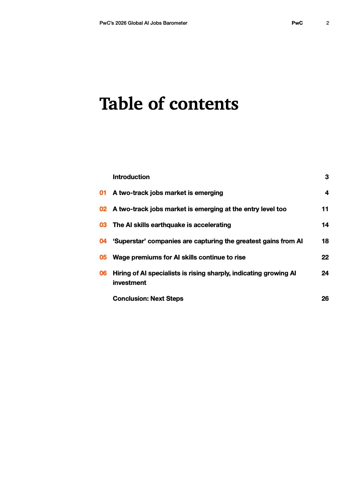

# 2026 Global Ai Jobs Barometer Full Report — Figure 1: Table of contents

**Source:** [[pwc-2026-global-ai-jobs-barometer]] | **Page:** 2

---

Type: table
Title: Table of contents
Axes: x: page number, y: section title
Key data points: Introduction: 3, 01 A two-track jobs market is emerging: 4, 02 A two-track jobs market is emerging at the entry level too: 11, 03 The AI skills earthquake is accelerating: 14, 04 'Superstar' companies are capturing the greatest gains from AI: 18, 05 Wage premiums for AI skills continue to rise: 22, 06 Hiring of AI specialists is rising sharply, indicating growing AI investment: 24, Conclusion: Next Steps: 26
Main finding: This table of contents outlines the structure and topics covered in the PwC's 2026 Global AI Jobs Barometer report, detailing the page numbers for each section.
