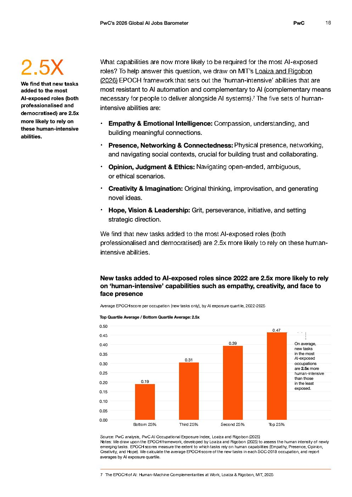

# 2026 Global Ai Jobs Barometer Full Report — Figure 10: New tasks added to AI-exposed roles since 2022 are 2.5x more likely to rely on 'human-intensive' capabilities such as empathy, creativity, and face to face presence

**Source:** [[pwc-2026-global-ai-jobs-barometer]] | **Page:** 16

---

Type: bar
Title: New tasks added to AI-exposed roles since 2022 are 2.5x more likely to rely on 'human-intensive' capabilities such as empathy, creativity, and face to face presence
Axes: x: AI exposure quartile, y: Average EPOCH score per occupation (new tasks only)
Key data points: Bottom 25%: 0.19, Third 25%: 0.31, Second 25%: 0.39, Top 25%: 0.47
Main finding: New tasks in the most AI-exposed occupations are 2.5 times more human-intensive than those in the least exposed occupations.
