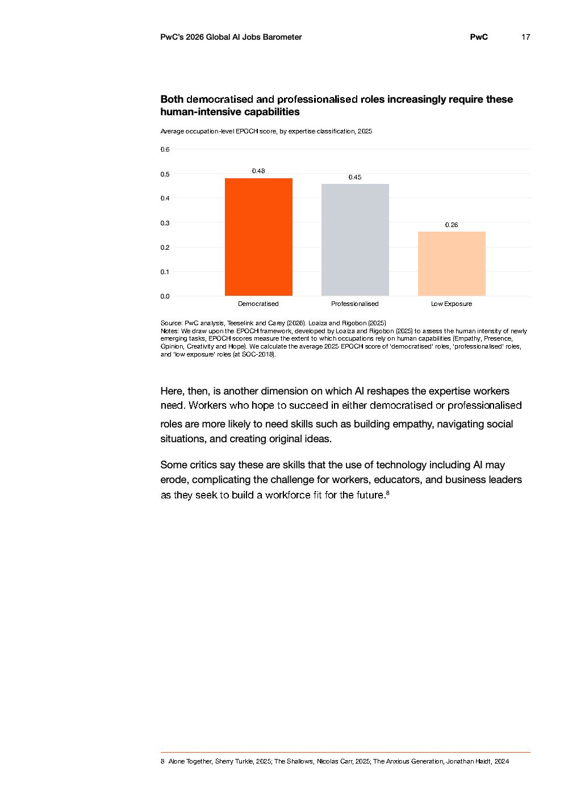

# 2026 Global Ai Jobs Barometer Full Report — Figure 11: Average occupation-level EPOCH score, by expertise classification, 2025

**Source:** [[pwc-2026-global-ai-jobs-barometer]] | **Page:** 17

---

Type: bar
Title: Average occupation-level EPOCH score, by expertise classification, 2025
Axes: x: Democratised, Professionalised, Low Exposure | y: EPOCH score
Key data points: Democratised: 0.48, Professionalised: 0.45, Low Exposure: 0.26
Main finding: Democratised and Professionalised roles have significantly higher average EPOCH scores, indicating a greater reliance on human capabilities, compared to Low Exposure roles.
