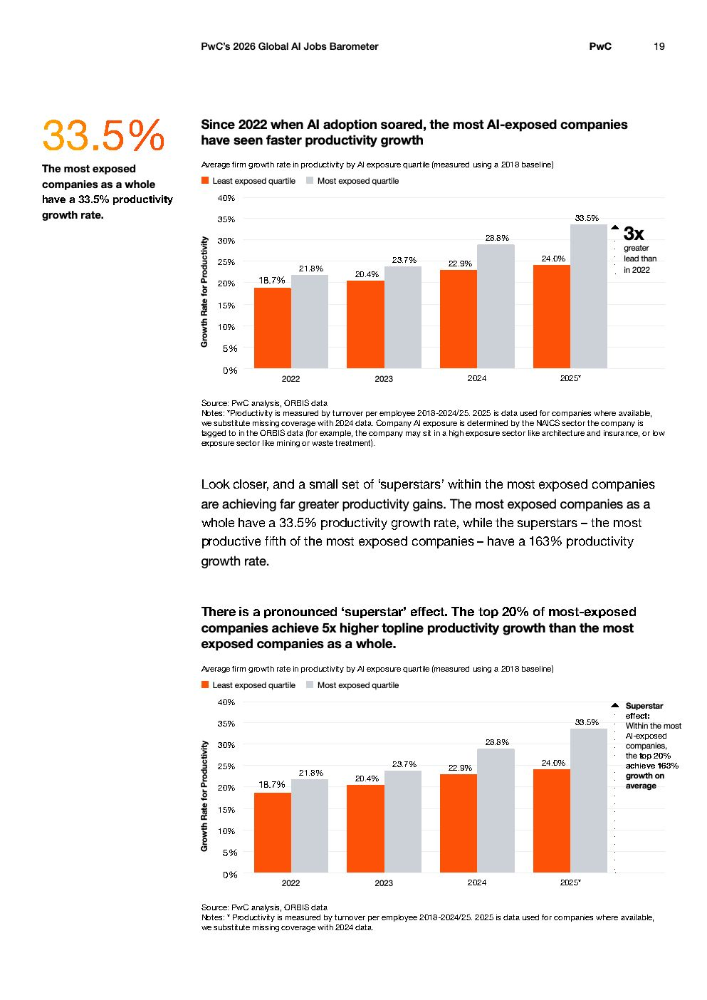

# 2026 Global Ai Jobs Barometer Full Report — Figure 12: Since 2022 when AI adoption soared, the most AI-exposed companies have seen faster productivity growth

**Source:** [[pwc-2026-global-ai-jobs-barometer]] | **Page:** 19

---

Type: bar
Title: Since 2022 when AI adoption soared, the most AI-exposed companies have seen faster productivity growth
Axes: x: Year, y: Growth Rate for Productivity
Key data points: 2022: Least exposed quartile 18.7%, Most exposed quartile 21.8%; 2023: Least exposed quartile 20.4%, Most exposed quartile 23.7%; 2024: Least exposed quartile 22.9%, Most exposed quartile 28.8%; 2025: Least exposed quartile 24.0%, Most exposed quartile 33.5%
Main finding: Companies with higher AI exposure consistently show faster productivity growth compared to less AI-exposed companies, with the gap widening over time, reaching a 3x greater lead by 2025.

Type: bar
Title: There is a pronounced 'superstar' effect. The top 20% of most-exposed companies achieve 5x higher topline productivity growth than the most exposed companies as a whole.
Axes: x: Year, y: Growth Rate for Productivity
Key data points: 2022: Least exposed quartile 18.7%, Most exposed quartile 21.8%; 2023: Least exposed quartile 20.4%, Most exposed quartile 23.7%; 2024: Least exposed quartile 22.9%, Most exposed quartile 28.8%; 2025: Least exposed quartile 24.0%, Most exposed quartile 33.5%
Main finding: The top 20% of most AI-exposed companies, referred to as 'superstars', achieve a significantly higher productivity growth rate of 163% on average, compared to the 33.5% growth rate of most AI-exposed companies as a whole.
