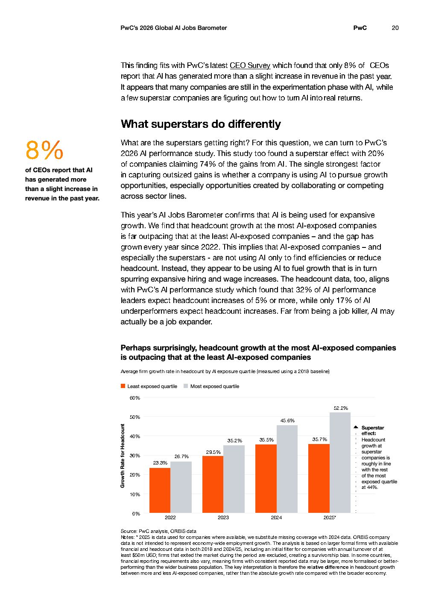

# 2026 Global Ai Jobs Barometer Full Report — Figure 13: Average firm growth rate in headcount by AI exposure quartile (measured using a 2018 baseline)

**Source:** [[pwc-2026-global-ai-jobs-barometer]] | **Page:** 20

---

Type: bar
Title: Average firm growth rate in headcount by AI exposure quartile (measured using a 2018 baseline)
Axes: x: Year, y: Growth Rate for Headcount
Key data points: 2022: Least exposed quartile 23.3%, Most exposed quartile 26.7%; 2023: Least exposed quartile 29.5%, Most exposed quartile 35.2%; 2024: Least exposed quartile 35.5%, Most exposed quartile 45.6%; 2025: Least exposed quartile 35.7%, Most exposed quartile 52.2%
Main finding: Headcount growth in companies with higher AI exposure consistently outpaces those with lower AI exposure, with the gap widening over time.
Unclear: The "Superstar effect" text is cut off.
