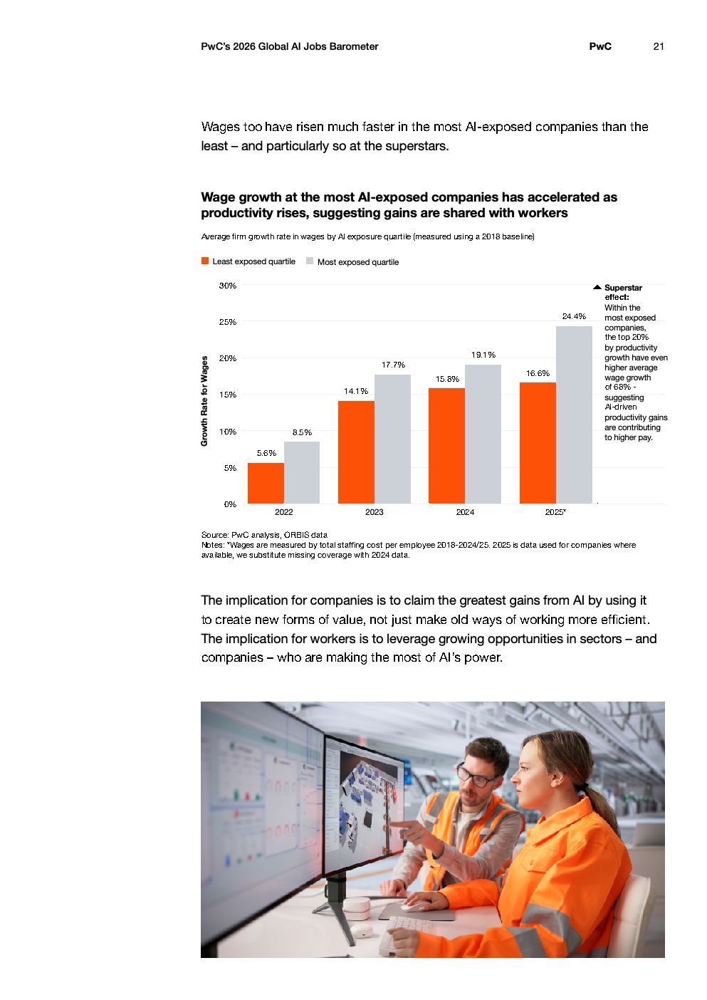

# 2026 Global Ai Jobs Barometer Full Report — Figure 14: Wage growth at the most AI-exposed companies has accelerated as productivity rises, suggesting gains are shared with workers

**Source:** [[pwc-2026-global-ai-jobs-barometer]] | **Page:** 21

---

Type: bar
Title: Wage growth at the most AI-exposed companies has accelerated as productivity rises, suggesting gains are shared with workers
Axes: x: Year, y: Growth Rate for Wages
Key data points: 2022: Least exposed quartile 5.6%, Most exposed quartile 8.5%; 2023: Least exposed quartile 14.1%, Most exposed quartile 17.7%; 2024: Least exposed quartile 15.8%, Most exposed quartile 19.1%; 2025: Least exposed quartile 16.6%, Most exposed quartile 24.4%
Main finding: Wage growth in AI-exposed companies has consistently outpaced that of less AI-exposed companies from 2022 to 2025, with the most AI-exposed companies showing significantly higher growth rates, especially in 2025.
Unclear: The exact definition of "Least exposed quartile" and "Most exposed quartile" is not fully detailed within the chart itself, though the surrounding text provides some context.
