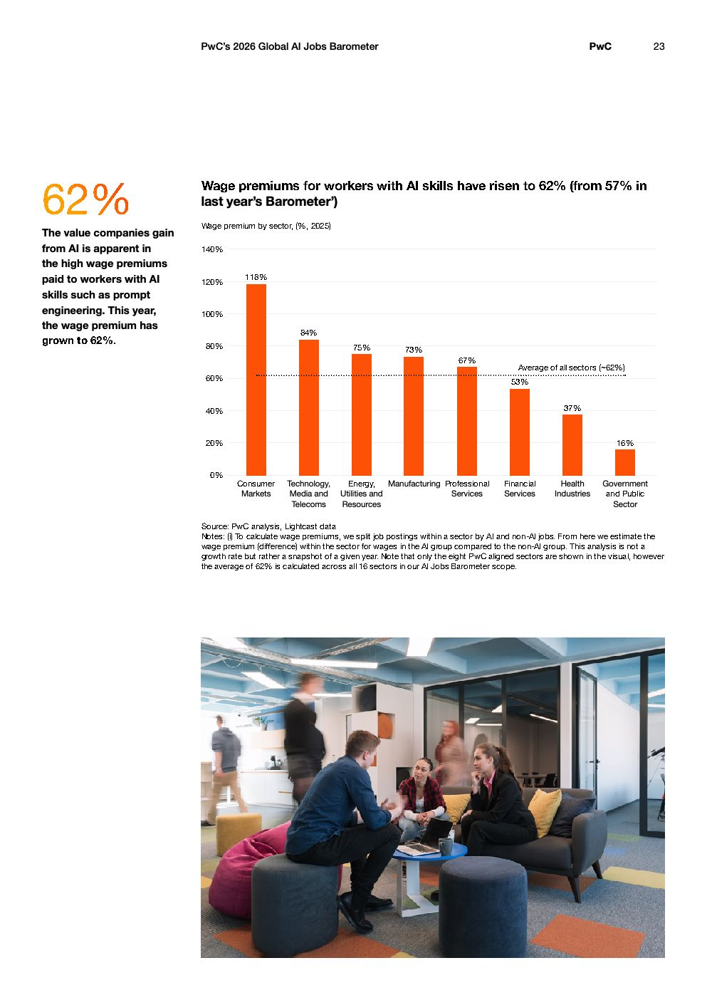

# 2026 Global Ai Jobs Barometer Full Report — Figure 15: Wage premiums for workers with AI skills have risen to 62% (from 57% in last year's Barometer)

**Source:** [[pwc-2026-global-ai-jobs-barometer]] | **Page:** 23

---

Type: bar
Title: Wage premiums for workers with AI skills have risen to 62% (from 57% in last year's Barometer)
Axes: x: Wage premium by sector, (%, 2025), y: Percentage
Key data points: Consumer Markets: 118%, Technology, Media and Telecoms: 84%, Energy, Utilities and Resources: 75%, Manufacturing: 73%, Professional Services: 67%, Financial Services: 53%, Health Industries: 37%, Government and Public Sector: 16%, Average of all sectors: ~62%
Main finding: Wage premiums for workers with AI skills vary significantly across sectors, with Consumer Markets showing the highest premium at 118% and Government and Public Sector the lowest at 16%, while the average across all sectors is approximately 62%.
Unclear: none
