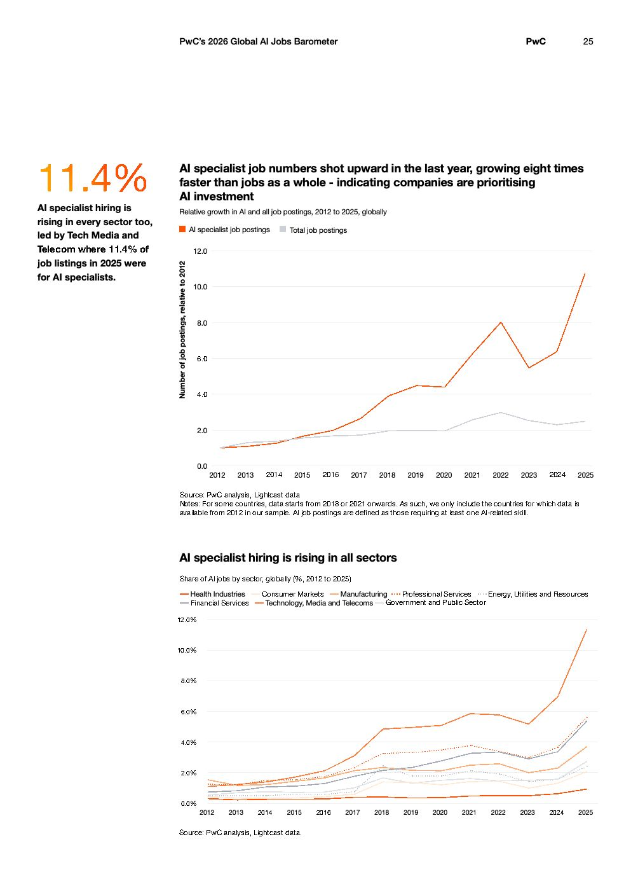

# 2026 Global Ai Jobs Barometer Full Report — Figure 16: AI specialist job numbers shot upward in the last year, growing eight times faster than jobs as a whole - indicating companies are prioritising AI investment

**Source:** [[pwc-2026-global-ai-jobs-barometer]] | **Page:** 25

---

Type: line
Title: AI specialist job numbers shot upward in the last year, growing eight times faster than jobs as a whole - indicating companies are prioritising AI investment
Axes: x: 2012 to 2025, y: Number of job postings, relative to 2012
Key data points: AI specialist job postings: 2012: 0.0, 2018: 2.0, 2022: 8.0, 2025: 11.0; Total job postings: 2012: 0.0, 2018: 1.0, 2022: 2.0, 2025: 2.0
Main finding: AI specialist job postings have grown significantly faster than total job postings, especially from 2018 onwards, indicating a strong prioritization of AI investment.

Type: line
Title: AI specialist hiring is rising in all sectors
Axes: x: 2012 to 2025, y: Share of AI jobs by sector, globally (%)
Key data points: Technology, Media and Telecoms: 2012: 0.0%, 2025: 11.4%; Health Industries: 2012: 0.0%, 2025: 4.0%; Financial Services: 2012: 0.0%, 2025: 3.0%; Manufacturing: 2012: 0.0%, 2025: 2.0%; Consumer Markets: 2012: 0.0%, 2025: 2.0%; Professional Services: 2012: 0.0%, 2025: 2.0%; Government and Public Sector: 2012: 0.0%, 2025: 1.0%; Energy, Utilities and Resources: 2012: 0.0%, 2025: 1.0%
Main finding: AI specialist hiring is increasing across all sectors, with Technology, Media and Telecoms leading significantly in the share of AI jobs by 2025.
