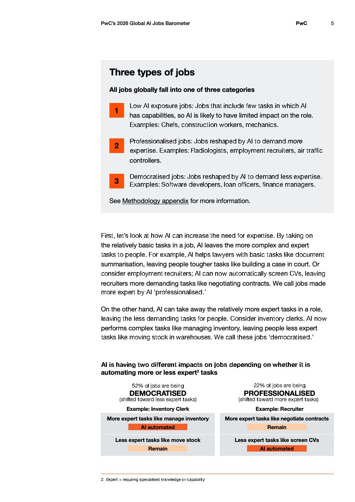

# 2026 Global Ai Jobs Barometer Full Report — Figure 2: AI is having two different impacts on jobs depending on whether it is automating more or less expert² tasks

**Source:** [[pwc-2026-global-ai-jobs-barometer]] | **Page:** 5

---

Type: table
Title: AI is having two different impacts on jobs depending on whether it is automating more or less expert² tasks
Key data points: 52% of jobs are being DEMOCRATISED, 22% of jobs are being PROFESSIONALISED, Inventory Clerk: More expert tasks like manage inventory (AI automated), Less expert tasks like move stock (Remain), Recruiter: More expert tasks like negotiate contracts (Remain), Less expert tasks like screen CVs (AI automated)
Main finding: AI is democratizing 52% of jobs by automating more expert tasks, leaving less expert tasks for humans, while professionalizing 22% of jobs by automating less expert tasks, leaving more expert tasks for humans.
