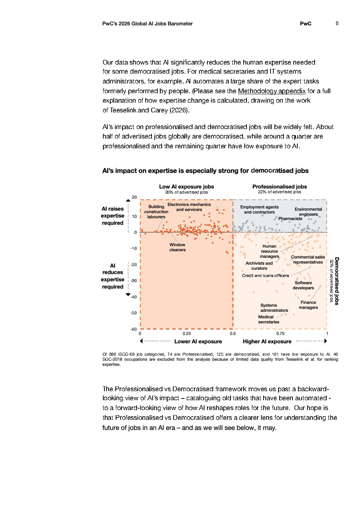

# 2026 Global Ai Jobs Barometer Full Report — Figure 3: AI's impact on expertise is especially strong for democratised jobs

**Source:** [[pwc-2026-global-ai-jobs-barometer]] | **Page:** 6

---

Type: scatter
Title: AI's impact on expertise is especially strong for democratised jobs
Axes: x: AI exposure (Lower AI exposure 0 to 0.5, Higher AI exposure 0.5 to 1), y: AI impact on expertise required (AI raises expertise required 0 to 20, AI reduces expertise required 0 to -60)
Key data points: Building construction labourers (low AI exposure, AI raises expertise), Electronics mechanics and servicers (low AI exposure, AI raises expertise), Employment agents and contractors (high AI exposure, AI raises expertise), Environmental engineers (high AI exposure, AI raises expertise), Pharmacists (high AI exposure, AI raises expertise), Window cleaners (low AI exposure, AI reduces expertise), Human resource managers (high AI exposure, AI reduces expertise), Archivists and curators (high AI exposure, AI reduces expertise), Credit and loans officers (high AI exposure, AI reduces expertise), Commercial sales representatives (high AI exposure, AI reduces expertise), Software developers (high AI exposure, AI reduces expertise), Systems administrators (high AI exposure, AI reduces expertise), Medical secretaries (high AI exposure, AI reduces expertise), Finance managers (high AI exposure, AI reduces expertise)
Main finding: The chart illustrates that AI's impact on expertise varies significantly across different job categories, with some jobs requiring more expertise due to AI and others requiring less, and this impact is particularly strong for democratised jobs with higher AI exposure.
Unclear: The exact numerical values for each job's AI exposure and expertise impact are not precisely labeled, only their general position on the scatter plot.
