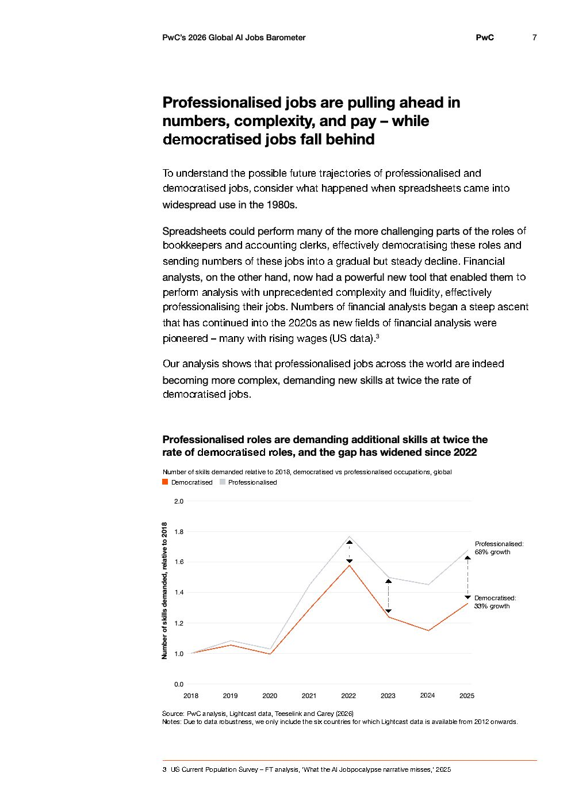

# 2026 Global Ai Jobs Barometer Full Report — Figure 4: Professionalised roles are demanding additional skills at twice the rate of democratised roles, and the gap has widened since 2022

**Source:** [[pwc-2026-global-ai-jobs-barometer]] | **Page:** 7

---

Type: line
Title: Professionalised roles are demanding additional skills at twice the rate of democratised roles, and the gap has widened since 2022
Axes: x: 2018, 2019, 2020, 2021, 2022, 2023, 2024, 2025 | y: Number of skills demanded, relative to 2018
Key data points: Democratised: 2018: 1.0, 2019: 1.08, 2020: 1.0, 2021: 1.3, 2022: 1.55, 2023: 1.2, 2024: 1.1, 2025: 1.33 (33% growth); Professionalised: 2018: 1.0, 2019: 1.05, 2020: 1.0, 2021: 1.5, 2022: 1.75, 2023: 1.4, 2024: 1.5, 2025: 1.68 (68% growth)
Main finding: Professionalised roles are demanding additional skills at twice the rate of democratised roles, with the gap widening significantly since 2022.
