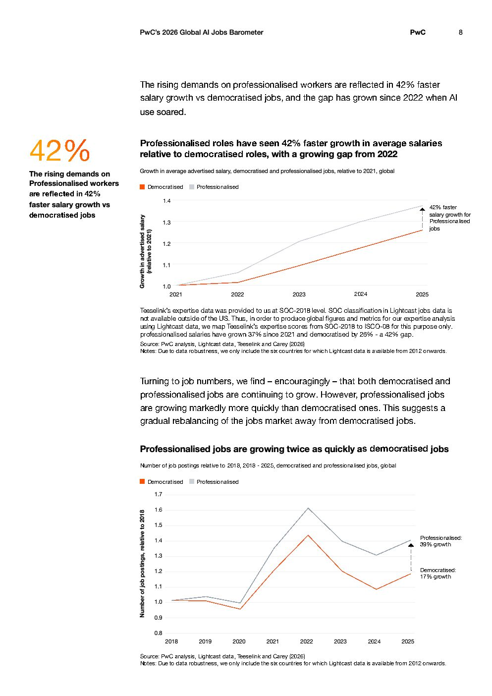

# 2026 Global Ai Jobs Barometer Full Report — Figure 5: Professionalised roles have seen 42% faster growth in average salaries relative to democratised roles, with a growing gap from 2022

**Source:** [[pwc-2026-global-ai-jobs-barometer]] | **Page:** 8

---

Type: line
Title: Professionalised roles have seen 42% faster growth in average salaries relative to democratised roles, with a growing gap from 2022
Axes: x: 2021, 2022, 2023, 2024, 2025 | y: Growth in advertised salary (relative to 2021)
Key data points: Professionalised salaries grown 37% since 2021, Democratised salaries grown 26% since 2021, 42% faster salary growth for Professionalised jobs
Main finding: Professionalised roles have experienced 42% faster salary growth compared to democratised roles, with this gap widening since 2022.

Type: line
Title: Professionalised jobs are growing twice as quickly as democratised jobs
Axes: x: 2018, 2019, 2020, 2021, 2022, 2023, 2024, 2025 | y: Number of job postings, relative to 2018
Key data points: Professionalised 39% growth, Democratised 17% growth
Main finding: Professionalised jobs are growing at more than twice the rate of democratised jobs, indicating a shift in the job market.
