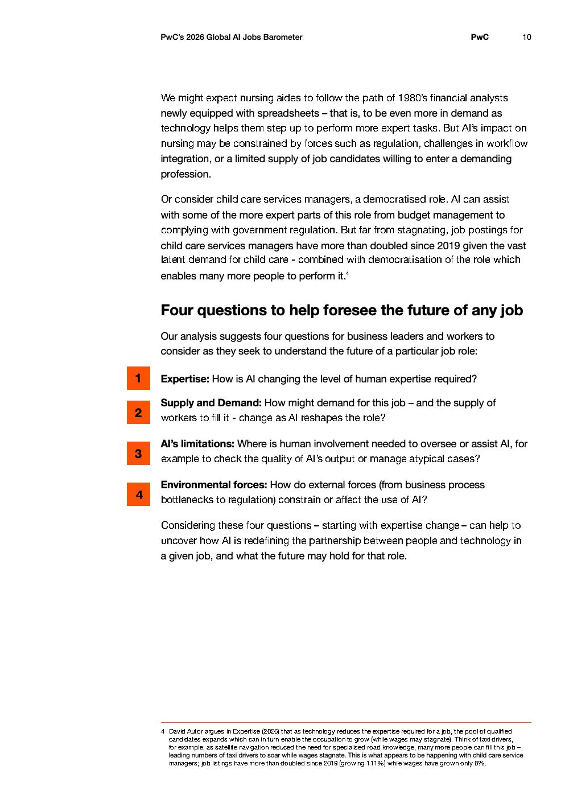

# 2026 Global Ai Jobs Barometer Full Report — Figure 6: Four questions to help foresee the future of any job

**Source:** [[pwc-2026-global-ai-jobs-barometer]] | **Page:** 10

---

Type: other
Title: Four questions to help foresee the future of any job
Key data points: 1 Expertise: How is AI changing the level of human expertise required?, 2 Supply and Demand: How might demand for this job - and the supply of workers to fill it - change as AI reshapes the role?, 3 AI's limitations: Where is human involvement needed to oversee or assist AI, for example to check the quality of AI's output or manage atypical cases?, 4 Environmental forces: How do external forces (from business process bottlenecks to regulation) constrain or affect the use of AI?
Main finding: Four key questions are presented to help understand how AI is redefining the partnership between people and technology in a given job and its future.
