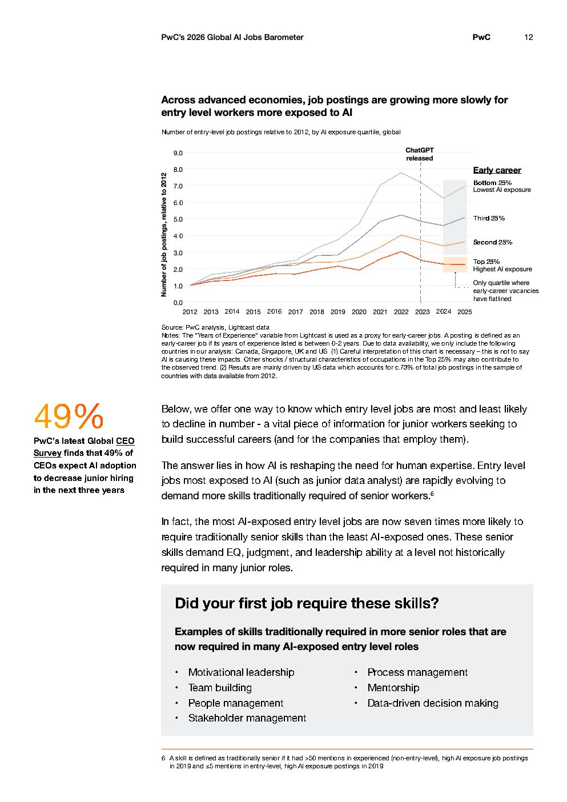

# 2026 Global Ai Jobs Barometer Full Report — Figure 7: Across advanced economies, job postings are growing more slowly for entry level workers more exposed to AI

**Source:** [[pwc-2026-global-ai-jobs-barometer]] | **Page:** 12

---

Type: line
Title: Across advanced economies, job postings are growing more slowly for entry level workers more exposed to AI
Axes: x: 2012-2025, y: Number of job postings, relative to 2012
Key data points: Bottom 25% (Lowest AI exposure) shows continuous growth from 1.0 in 2012 to ~8.0 in 2025; Third 25% shows continuous growth from 1.0 in 2012 to ~7.0 in 2025; Second 25% shows continuous growth from 1.0 in 2012 to ~6.0 in 2025; Top 25% (Highest AI exposure) shows growth from 1.0 in 2012 to ~5.0 in 2022, then flattens to ~5.0 in 2025. ChatGPT released in late 2022.
Main finding: Entry-level job postings in quartiles with lower AI exposure continue to grow, while those in the highest AI exposure quartile have flatlined since 2022, coinciding with the release of ChatGPT.
Unclear: The exact values for each quartile in 2023, 2024, and 2025 are estimates from the graph.
