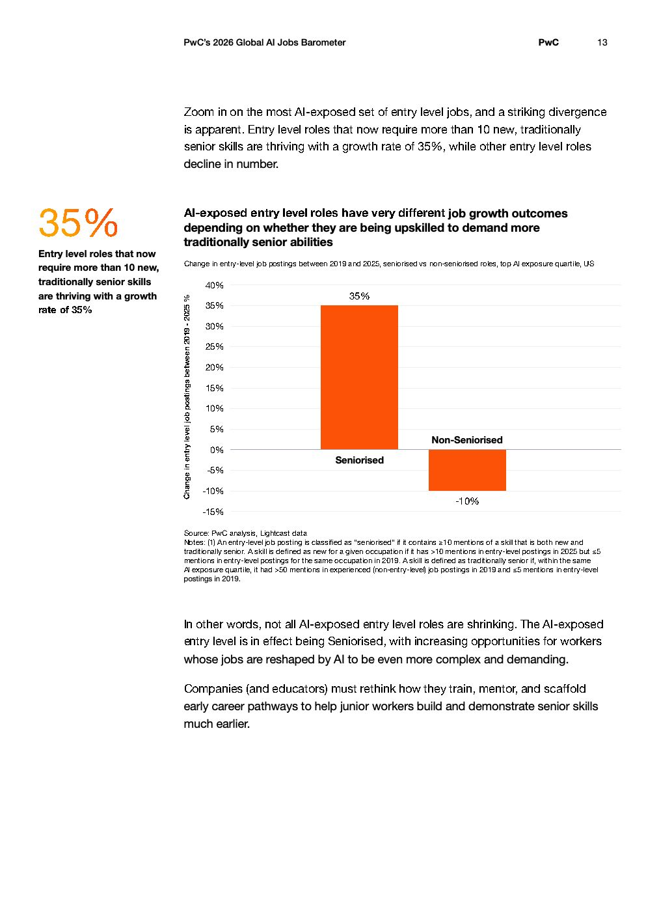

# 2026 Global Ai Jobs Barometer Full Report — Figure 8: Change in entry-level job postings between 2019 and 2025, seniorised vs non-seniorised roles, top AI exposure quartile, US

**Source:** [[pwc-2026-global-ai-jobs-barometer]] | **Page:** 13

---

Type: bar
Title: Change in entry-level job postings between 2019 and 2025, seniorised vs non-seniorised roles, top AI exposure quartile, US
Axes: x: Seniorised | Non-Seniorised, y: Change in entry level job postings between 2019 - 2025 %
Key data points: Seniorised: 35%, Non-Seniorised: -10%
Main finding: Entry-level job postings that have been "seniorised" (requiring more traditionally senior skills) are projected to grow by 35% between 2019 and 2025, while non-seniorised entry-level job postings are expected to decline by 10%.
