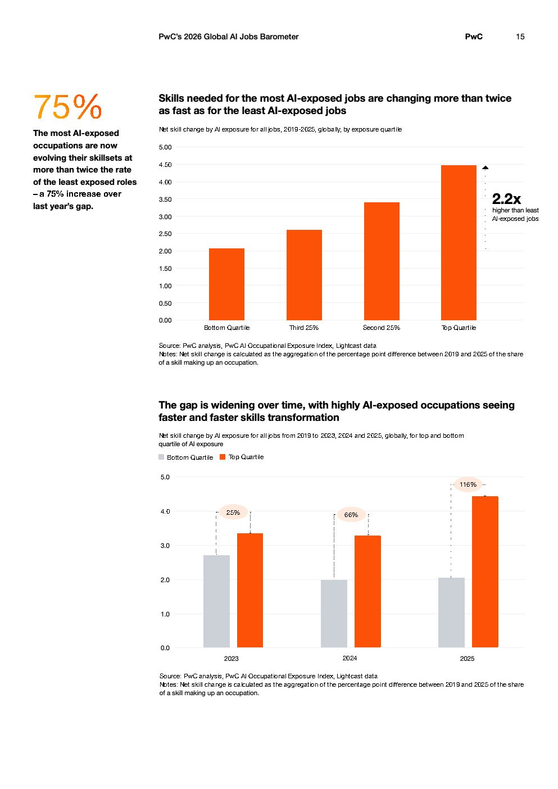

# 2026 Global Ai Jobs Barometer Full Report — Figure 9: Skills needed for the most AI-exposed jobs are changing more than twice as fast as for the least AI-exposed jobs

**Source:** [[pwc-2026-global-ai-jobs-barometer]] | **Page:** 15

---

Type: bar
Title: Skills needed for the most AI-exposed jobs are changing more than twice as fast as for the least AI-exposed jobs
Axes: x: Bottom Quartile, Third 25%, Second 25%, Top Quartile | y: Net skill change by AI exposure for all jobs, 2019-2025, globally, by exposure quartile
Key data points: Bottom Quartile: ~2.1, Third 25%: ~2.6, Second 25%: ~3.3, Top Quartile: ~4.6, 2.2x higher than least AI-exposed jobs
Main finding: The net skill change for AI-exposed jobs increases significantly with higher AI exposure, with the top quartile experiencing 2.2 times more change than the bottom quartile.

Type: bar
Title: The gap is widening over time, with highly AI-exposed occupations seeing faster and faster skills transformation
Axes: x: 2023, 2024, 2025 | y: Net skill change by AI exposure for all jobs from 2019 to 2023, 2024 and 2025, globally, for top and bottom quartile of AI exposure
Key data points: 2023 Bottom Quartile: ~2.8, 2023 Top Quartile: ~3.4 (25% higher), 2024 Bottom Quartile: ~2.0, 2024 Top Quartile: ~3.3 (66% higher), 2025 Bottom Quartile: ~2.0, 2025 Top Quartile: ~3.3 (116% higher)
Main finding: The skill transformation gap between the top and bottom quartiles of AI-exposed occupations is widening over time, with the top quartile showing increasingly faster skill changes.
