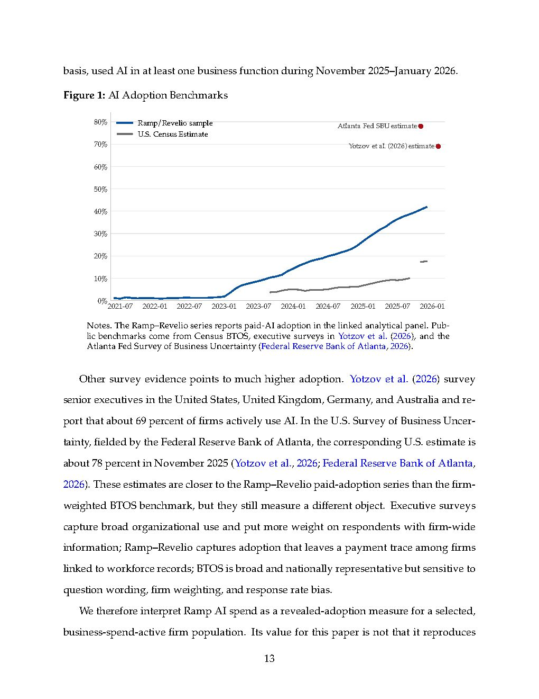

# Figure 1: AI Adoption Benchmarks

## Description
This chart compares AI adoption rates across different measurement methodologies. The Ramp/Revelio series tracks paid-AI adoption in their analytical panel, showing adoption rates rising from approximately 10% in early 2023 to over 60% by mid-2026. This is contrasted with U.S. Census estimates (17-20%), Atlanta Fed Survey of Business Uncertainty (78%), and Yotzov et al. executive survey estimates (69%). The visualization demonstrates that "AI adoption" lacks a single empirical rate due to varying measurement approaches - some capture broad organizational use while others measure only paid, sustained adoption with payment traces.

## Key Insights
- Different methodologies yield dramatically different adoption rates (from 17% to 78%)
- Ramp/Revelio measures sustained paid adoption requiring $100/month for 3 consecutive months
- Executive surveys capture broader organizational awareness but may overstate actual implementation
- The measurement approach fundamentally shapes conclusions about AI's economic impact

## Source
See [[ramp-revelio-2026-ai-jobs-impact-study]]

## Related Concepts
- ai-adoption-measurement-challenges
- [[methodological-heterogeneity-in-ai-studies]]
- [[ai-professionalization]]