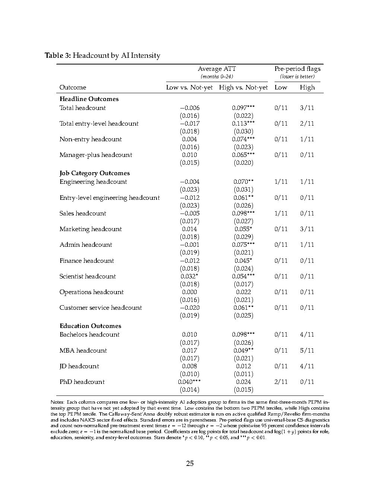

# Figure 7: Entry-Level Headcount Event Study

## Description
This event study chart reveals that high-intensity AI adoption increases entry-level headcount by 12.0% over 24 months. The effect becomes statistically significant around 6 months post-adoption and continues growing throughout the observation window. This finding directly contradicts predictions that AI adoption would reduce junior employment opportunities, showing instead that intensive AI users expand their entry-level workforce.

## Key Insights
- High-intensity AI adopters increase entry-level headcount by 12.0%
- Entry-level share rises by 1.15 percentage points among high-intensity adopters
- Growth pattern mirrors total headcount but with stronger early effects
- Counters narrative that AI displaces entry-level workers in adopting firms

## Source
See [[ramp-revelio-2026-ai-jobs-impact-study]]

## Related Concepts
- [[entry-level-squeeze]]
- [[seniorised-roles]]
- [[human-intensive-skills]]