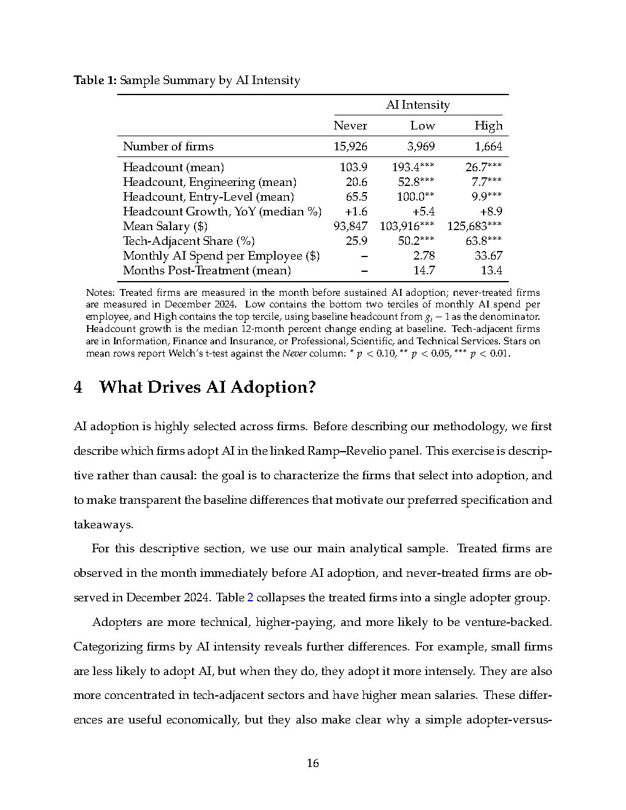

# ramp-revelio-2026-fig-2-ai-adoption-by-sector

## Description
This figure shows AI adoption rates by sector as of December 2025, measured as the percentage of firms adopting AI in each sector.

## Key Data Points
- **Information**: 53.7% adoption rate
- **Finance and Insurance**: 43.6% adoption rate
- **Professional, Scientific, and Technical Services**: 36.0% adoption rate
- **Management of Companies and Enterprises**: 26.1% adoption rate
- **Real Estate and Rental and Leasing**: 24.7% adoption rate
- **Administrative and Support**: 22.8% adoption rate
- **Manufacturing**: 22.8% adoption rate
- **Transportation and Warehousing**: 22.5% adoption rate
- **Retail Trade**: 21.7% adoption rate
- **Utilities**: 20.7% adoption rate
- **Educational Services**: 19.8% adoption rate
- **Wholesale Trade**: 19.1% adoption rate
- **Mining, Quarrying, and Oil and Gas Extraction**: 17.6% adoption rate
- **Agriculture, Forestry, Fishing and Hunting**: 17.3% adoption rate
- **Construction**: 15.1% adoption rate
- **Health Care and Social Assistance**: 14.3% adoption rate
- **Other Services**: 13.3% adoption rate
- **Accommodation and Food Services**: 11.5% adoption rate
- **Arts, Entertainment, and Recreation**: 11.3% adoption rate

## Main Findings
- AI adoption is highest in information-intensive sectors
- Adoption is much lower in construction, healthcare, and service sectors
- The pattern aligns with a task-based interpretation: firms with workforces concentrated in software, analytical, and information-processing work are more likely to find immediate uses for generative AI

## Significance
This sectoral pattern explains why early employment gains from AI are concentrated in the Information sector. It also suggests that AI adoption may diffuse more slowly to non-technical sectors where AI vendors have yet to find product-market fit.

## Related Concepts
- [[value-chain-shift]]
- [[ai-job-future-framework]]

## Source
See [[ramp-revelio-2026-ai-jobs-impact-study|Figure 2: AI Adoption by Sector]]