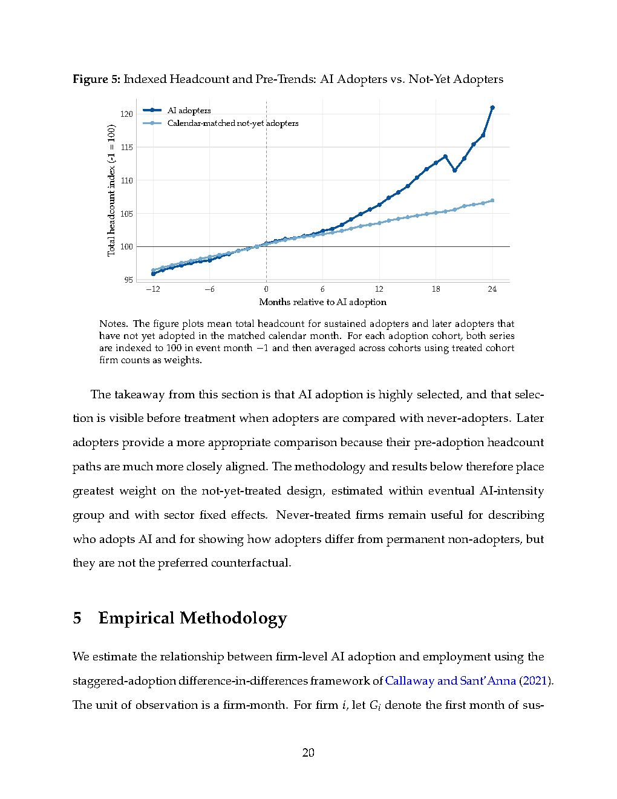

# ramp-revelio-2026-fig-6-total-headcount

## Description
This event study figure shows the impact of AI adoption on total headcount for high-intensity adopters compared to later adopters in the same intensity group.

## Key Data Points
- **Month of adoption (0)**: 0.3% increase in headcount
- **3 months after adoption**: 2.0% increase
- **6 months after adoption**: 7.1% increase
- **12 months after adoption**: 18.8% increase
- **18 months after adoption**: 27.7% increase (32% growth)
- **24 months after adoption**: 45.2% increase (57% growth)

## Main Findings
- High-intensity AI adopters experience significant employment growth following adoption
- Gains emerge gradually and compound over time, suggesting a "learning curve"
- The growth pattern indicates firms may need 6-12 months to establish best practices and integrate AI tools before expanding hiring
- By 18 months, high-intensity adopters have grown headcount by approximately 32%

## Significance
This figure directly contradicts predictions that AI adoption will lead to broad job losses. Instead, it shows that substantial AI investments are associated with significant employment growth, particularly as firms gain experience with the technology.

## Related Concepts
- [[high-intensity-ai-adopters]]
- [[superstar-effect]]
- [[ai-professionalization]]

## Source
See [[ramp-revelio-2026-ai-jobs-impact-study|Figure 6: Total Headcount]]